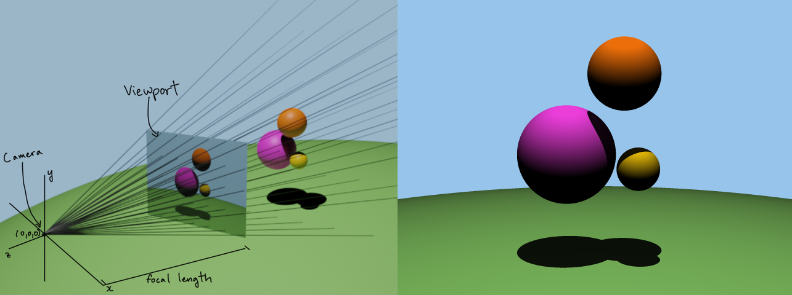
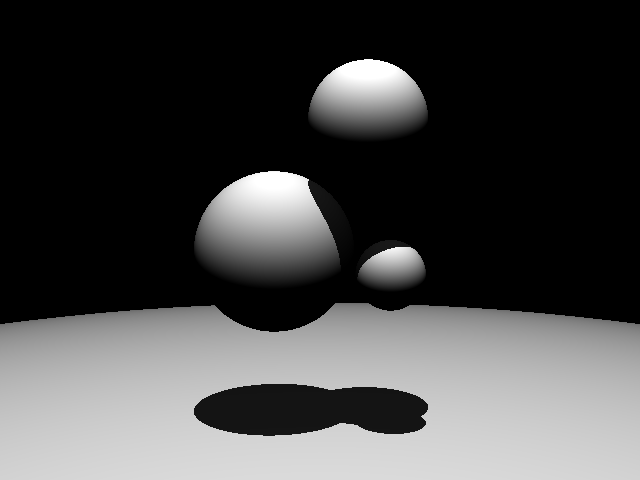
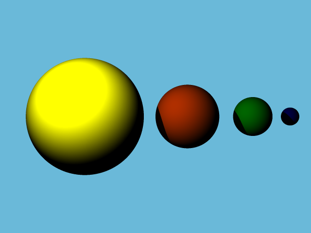

<div align="center">

# 🏎️ C-Ray Engine
### High-Performance 3D Ray Tracing Engine in Pure C


<br />



</div>

---

## 💡 Project Overview

**C-Ray** is a physics-based rendering engine built entirely from scratch in standard C. Unlike modern engines that rely on OpenGL or DirectX, this project implements the mathematical foundations of computer graphics—vector calculus, ray-object intersection, and lighting physics—without external graphics libraries.

The goal of this project was to engineer a high-performance system that manages its own memory, defines its own linear algebra structures, and produces high-resolution, anti-aliased images via raw pixel manipulation.

---

## 🛠️ Key Technical Features

### 1. Core Engine & Mathematics
* **Custom Linear Algebra Library:** Implemented a robust `Vec3` library from scratch to handle vector addition, normalization, cross/dot products, and scalar manipulation.
* **Parametric Ray Casting:** Implements the ray equation $R(t) = \vec{O} + t\vec{D}$ to simulate light paths through a 3D viewport.
* **Intersection Algorithms:** Uses quadratic discriminant analysis ($b^2 - 4ac$) to solve ray-sphere intersections in $O(1)$ time per object.

### 2. Rendering Pipeline
* **Physics-Based Lighting:** Implements diffuse shading based on surface normals and light source proximity (Inverse-Square Law fallout).
* **Hard Shadow Casting:** Secondary ray casting passes to determine light occlusion and render realistic shadows.
* **Anti-Aliasing (SSAA):** Implements **9-sample Grid Super-Sampling** per pixel to eliminate jagged edges and produce smooth, high-fidelity renders.
* **Scene Graph:** Dynamic object management system using custom-built dynamic arrays (vectors) to handle scenes with $N$ spheres.

### 3. Systems Engineering
* **Manual Memory Management:** rigorous dynamic allocation and deallocation of scene objects to ensure zero memory leaks.
* **File I/O:** Custom encoder to serialize render data into the **PPM (Portable Pixel Map)** format for lossless image output.
* **Hex-to-RGB Bitwise Operations:** Low-level bit manipulation to parse hexadecimal color inputs into normalized floating-point vector spaces.

---

## 📸 Render Gallery

| **Feature** | **Visual** |
| :--- | :--- |
| **Milestone: Base Rendering**<br>Basic geometry and flat colors. |  |
| **Milestone: Physics Lighting**<br>Implementation of shadows and light diffusion. |  |
| **Final: Anti-Aliasing**<br>Full resolution with 9x sampling and complex geometry. |  |

---

## 🚀 How to Build & Run

This project uses a custom `Makefile` for compilation.

### Prerequisites
* GCC Compiler
* Make

### Compilation
To compile the engine with full optimization and anti-aliasing enabled:

```bash
make
