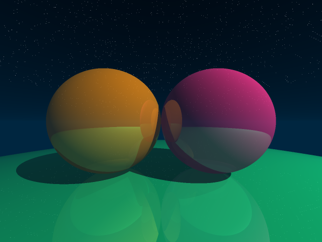
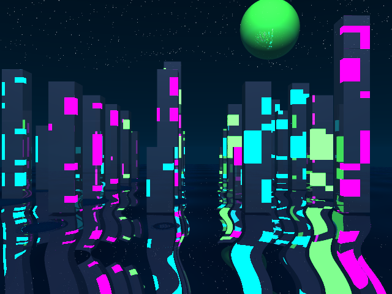
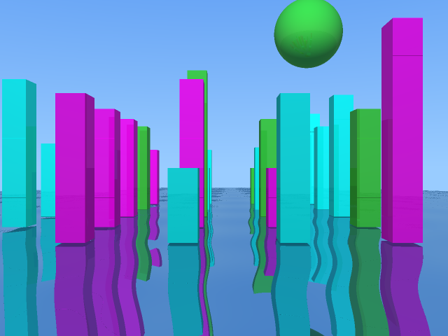
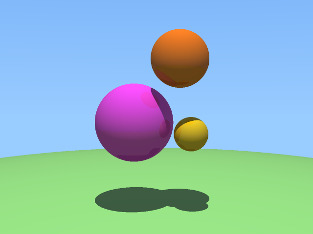
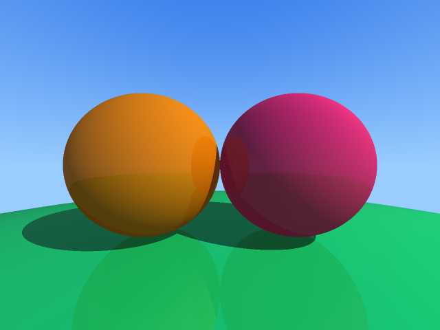
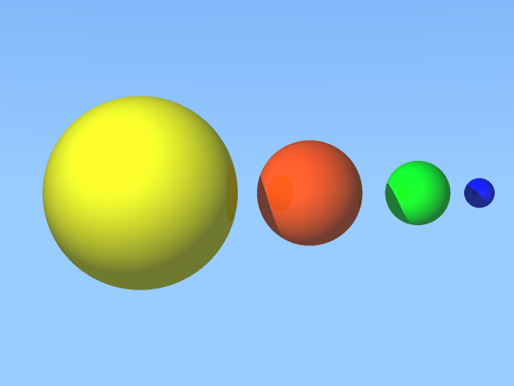
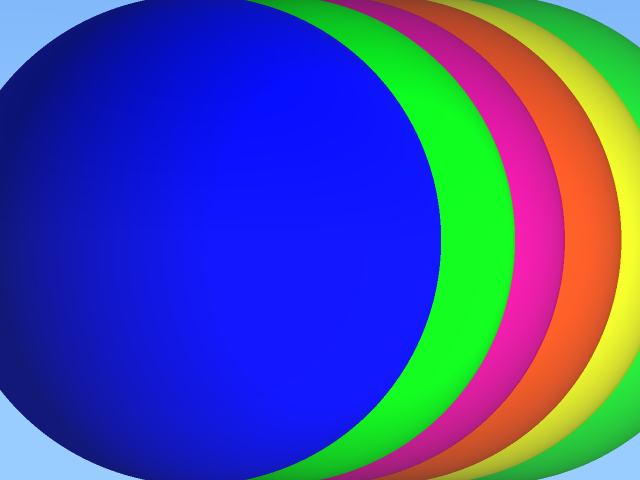

# C-Ray Engine
### High-Performance 3D Ray Tracing Engine in Pure C

 

 

## Project Overview

**C-Ray** is a physics-based rendering engine built entirely from scratch in standard C. Unlike modern engines that rely on OpenGL or DirectX, this project implements the mathematical foundations of computer graphics—vector calculus, ray-object intersection, and lighting physics—without external graphics libraries.

The goal was to engineer a high-performance system that manages its own memory, defines its own linear algebra structures, and produces high-resolution, anti-aliased images via raw pixel manipulation.

Recently, the engine has been upgraded to support **Dual-Mode Rendering**, capable of simulating both realistic daytime physics (Fresnel water, directional sunlight) and stylized Cyberpunk aesthetics (procedural neon, exponential fog) from the same scene data.

---

## Key Technical Features

### 1. Core Engine & Mathematics
* **Custom Linear Algebra Library:** Implemented a robust `Vec3` library from scratch to handle vector addition, normalization, cross/dot products, and reflection vectors.
* **Parametric Ray Casting:** Implements the ray equation R(t) = O + tD to simulate light paths through a 3D viewport.
* **Intersection Algorithms:** Uses quadratic discriminant analysis for spheres and Axis-Aligned Bounding Box (AABB) logic for cubic structures.

### 2. The "Dual-Mode" Physics System
The engine features a runtime-switchable physics pipeline that alters material properties based on the desired atmosphere:

| **Day Mode** | **Night Mode** |
| :--- | :--- |
| **Lighting:** Directional Sunlight (Hard Shadows) | **Lighting:** Emissive Neon & Ambient Occlusion |
| **Sky:** Linear Gradient (Blue Atmosphere) | **Sky:** Exponential Fog (Teal/Black Void) |
| **Materials:** Glossy Plastic & Concrete | **Materials:** Procedural Grid Textures (Lit Windows) |
| **Water:** Fresnel Reflection (Mirror-like) | **Water:** Octave Noise Distortion (Fractal Waves) |

### 3. Procedural Generation
* **City Architecture:** Python-based procedural generation scripts create massive cityscapes with randomized building heights, "monolith" structures, and street layouts.
* **Fractal Water:** A custom shader combines low-frequency "swells" with high-frequency "grain" noise to simulate realistic liquid surfaces without using texture maps.

---

## Render Gallery

### The Cyberpunk & Future City Collection
*Demonstrating the Dual-Mode Engine capabilities on procedurally generated geometry.*

| **Night Mode (Cyberpunk)** | **Day Mode (Future City)** |
| :--- | :--- |
|  |  |
| *Procedural neon windows, teal fog, and distorted water reflections.* | *Directional sunlight, glossy materials, and clean atmospheric scattering.* |

### The Geometric Studies
*A series of test scenes demonstrating shadow casting, reflection recursion, and composition.*

| **Scene 1: The Basics** | **Scene 2: Symmetry** |
| :--- | :--- |
|  |  |
| *Testing ground plane intersections and simple shadows.* | *Testing equidistant object spacing and camera focal length.* |

| **Scene 3: Depth** | **Scene 4: Complexity** |
| :--- | :--- |
|  |  |
| *Testing recursive reflections on multiple surfaces.* | *Stress-testing the intersection engine with overlapping geometry.* |

---

## How to Build & Run

This project uses a custom `Makefile` pipeline. No external libraries are required.

### 1. Compile the Engine
Compile the source code with full optimization (`-O3`) and all warnings enabled (`-Wall -Werror`).

I used: gcc -Wall -Werror -std=c99 -DFS -o FS_assg src/spheres.c src/assg.c src/vector.c src/color.c -lm

### 2. Generate a Scene
Use the included Python generators to create a scene description file (test.input).

### For the Infinite City:

run the command: python water_city.py

### For Geometric Scenes:

run the command: python gen_scene_1.py  # (Or gen_scene_2.py, etc.)

### 3. Render the Image
Run the engine executable. You must specify the input file, output filename, and the render mode (day or night).

### To render the Cyberpunk Night scene:

run the script:  ./FS_assg test.input output_night.ppm night

### To render the Daytime scene:
All you have to do is replace the night with day, ./FS_assg test.input output_night.ppm day

The output image will be saved as a high-resolution PPM file, which can be viewed in standard image viewers or converted to PNG/JPG.

### If you do end up with difficulties please do not hesitate to reach out! Just click my profile and you will find multiple ways to contact me
